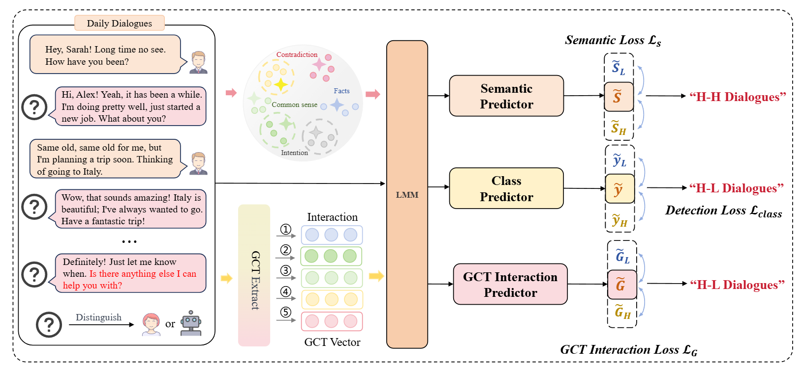

# ChatbotID: Identifying Chatbots with Granger Causality Test
With the increasing sophistication of Large Language Models (LLMs), it is crucial to develop reliable methods to accurately identify whether an interlocutor in real-time dialogue is human or chatbot.However, existing detection methods are primarily designed for analyzing full documents, not the unique dynamics and characteristics of dialogue. These approaches frequently overlook the nuances of interaction that are essential in conversational contexts.This study identifies two key characteristics in dialogues: (1) human-human interactions exhibit significant bidirectional sentiment influence, and (2) human-LLMs interactions display a clear asymmetric pattern.
This work identifies two key patterns in dialogues: (1) Human-Human (H-H) interactions exhibit significant bidirectional sentiment influence, while (2) Human-Chatbot (H-C) interactions display a clear asymmetric pattern. We propose an innovative approach named ChatbotID, which applies the Granger Causality Test (GCT) to extract a novel set of interactional features that capture the evolving, predictive relationships between conversational attributes. By synergistically fusing these GCT-based interactional features with contextual embeddings, and optimizing the model through a meticulous loss function. These interaction features are integrated with contextual embeddings from a pre-trained LLM. The classification head uses enhanced embeddings to distinguish between H-H and H-M dialogues. Experimental results across multiple datasets and detection models demonstrate the effectiveness of our framework, with significant improvements in accuracy for distinguishing between H-H and H-C dialogues.

# HH-HC Dataset
This dataset is built based on [DailyDialog](http://yanran.li/dailydialog). By replacing certain dialogue turns with responses generated by large language models (e.g., DeepSeek-V3, ChatGPT, LLama etc.), we have created a dataset containing both original human-human (H-H) dialogues and human-chatbot (H-C) dialogues. This dataset can be used for tasks such as dialogue system evaluation, studies on the characteristics of human-chatbot conversations, and detection of LLMs-generated content.

## Table of Contents

- [HH-HC Dataset](#hh-hc-dataset)
  - [Introduction](##introduction)
  - [Dataset Features](##dataset-features)
  - [Dataset Structure](##dataset-structure)
  - [Data Format](##data-format)
  - [Getting Started](##getting-started)
    - [Environment Dependencies](###environment-dependencies)
    - [Acquire Raw Data](###acquire-raw-data)
    - [Generate Dataset](###generate-dataset)
    - [Loading Data Example](###loading-data-example)
  - [Data Dictionary](##data-dictionary)
    - [Explanation of Turns (`utterances`)](###explanation-of-turns-utterances)
    - [Example JSON Object](###example-json-object)
- [ChatbotIdentifier](#chatbotidentifier)
  - [Features](##features)
  - [Dependencies](##dependencies)
  - [Setup and Installation](##setup-and-installation)
  - [Configuration](##configuration)
  - [Dataset Preparation](##dataset-preparation)
  - [Usage](##usage)
    - [Semantic Attribution via API](###semantic-attribution-via-api)
  - [Model Architecture](##model-architecture)
  - [Model Saving (LoRA Adapters)](##model-saving-lora-adapters)


## Introduction

* **Background**: With advancements in large language models for dialogue generation, distinguishing between human-generated and LLMs-generated conversations has become increasingly important and challenging. This dataset aims to provide a parallel corpus containing both types of dialogues.
* **Objectives**:
    * Provide paired H-H and H-C dialogue data.
    * Support research on the quality and naturalness of human-chatbot dialogues.
    * Be used for training and evaluating models that distinguish between human and LLMs-generated text.
* **Data Source**: The original dialogue data comes from the DailyDialog dataset. The machine responses in H-C dialogues are generated by the `scripts/build_dataset.py` script calling a specified large language model (default is DeepSeek-V3).

## Dataset Features

* **Original Data**: [DailyDialog Dataset](http://yanran.li/dailydialog)
* **Generation Model**: DeepSeek-V3 (or other models configured via API)
* **Data Size**: Depends on the `sample_size` parameter; each original dialogue generates one H-H and one H-C sample. For example, `sample_size=50` will generate 100 records.
* **Language**: English (derived from DailyDialog)
* **Key Features**:
    * Contains parallel H-H and H-C dialogues.
    * Computer responses in H-C dialogues are contextually generated.
    * Includes clear label (`label`) and type (`type`) fields.


## Dataset Structure:


- **`data/`**: Contains the final generated dataset files.
  - `dialog_dataset.jsonl`: A line-delimited JSON file where each line is a JSON object. 

- **`docs/`**: Documentation directory.
  - `data_dictionary.md`: Data dictionary file that provides detailed descriptions of each field in the dataset.

- **`scripts/`**: Scripts for dataset generation and processing.
  - `build_dataset.py`: The main Python script used to generate the dataset.
  - `chatbot_identifier_lora.py` The main Python script used to identify H-H and H-C.
  

- **`LICENSE`**

- **`README.md`**
- `requirements.txt`: A list of Python dependencies required to run the scripts.

## Data Format

The dataset is provided in two formats:

1. **`dialog_dataset.jsonl`**:
    * Each line is an independent JSON object representing a dialogue.
    * UTF-8 encoded.
2. **`dialog_dataset.json`**:
    * A JSON file containing a list of all dialogue objects.
    * UTF-8 encoded and formatted for readability.

Each dialogue object contains the following fields (see [Data Dictionary](#data-dictionary) for more details):
* `dialog_id` (String): The unique identifier for the dialogue, with different prefixes for H-H and H-C versions.
* `utterances` (List of Strings): A list of all utterances in the dialogue.
* `label` (Integer): Label (0 for H-H, 1 for H-C).
* `type` (String): Dialogue type ("human-human" or "human-chatbot").

## Getting Started

### Environment Dependencies

1. Python (recommended version 3.7 or higher).
2. Install necessary Python packages:
    ```bash
    cd scripts
    pip install -r requirements.txt
    ```

### Acquire Raw Data

1. Download the DailyDialog dataset. This is typically a text file named `dailydialog.txt`. You can obtain it from the [DailyDialog Official Website](http://yanran.li/dailydialog).
2. Place the `dailydialog.txt` file in the root directory of the project, or modify its path in `scripts/build_dataset.py` as needed.
    * (Optional) You can use script in the `scripts/` directory to automate the download:
        ```bash
        # scripts/download_dailydialog.sh (example)
        echo "Downloading DailyDialog dataset..."
        # wget or curl command to download, e.g.:
        # wget http://yanran.li/files/ijcnlp_dailydialog.zip
        # unzip ijcnlp_dailydialog.zip
        # mv ijcnlp_dailydialog/dialogues_text.txt ../dailydialog.txt
        # echo "Please check and place dailydialog.txt in the project root or update script path."
        ```

### Generate Dataset

1. **Configure API Key**:
    Open the `scripts/build_dataset.py` file and modify the following lines in the `main()` function with your API key and correct Base URL:
    ```python
    API_KEY = "your-api-key-here"  # Replace with your API key
    BASE_URL = "xxxxx" # Replace with your API base URL
    MODEL_NAME = "xxxx # Or the model you are using
    ```
2. **Run the Script**:
    Run the following command in the project's root directory:
    ```bash
    python scripts/build_dataset.py
    ```
    The script will perform the following actions:
    * Load `dailydialog.txt`.
    * Filter dialogues based on `min_turns`, `max_turns`, `sample_size` parameters.
    * For each selected dialogue:
        * Create an H-H version.
        * Call the large model API to generate an H-C version (replacing one party in the original dialogue).
    * Save the generated data to `data/dialog_dataset.jsonl` and `data/dialog_dataset.json`.

    You can adjust the parameters in the `main()` function of `scripts/build_dataset.py` to control dataset generation, e.g.:
    ```python
    builder.build_dataset(
        dailydialog_path="dailydialog.txt", # Ensure correct path
        output_path="data/dialog_dataset.jsonl", # Output path
        min_turns=4,
        max_turns=8,
        sample_size=50 # For example, generate H-H and H-C versions for 50 original dialogues
    )
    ```
    **Note**: Generating H-C dialogues involves calling an external API, which may incur costs and take time. `time.sleep(0.5)` is used to avoid hitting API rate limits.

### Loading Data Example

**Python (Loading JSONL) Example:**
```python
import json

dataset = []
file_path = 'data/dialog_dataset.jsonl' # Ensure correct path
try:
    with open(file_path, 'r', encoding='utf-8') as f:
        for line in f:
            dataset.append(json.loads(line))

    if dataset:
        print(f"Successfully loaded {len(dataset)} dialogues.")
        print("First dialogue example:")
        print(json.dumps(dataset[0], indent=2, ensure_ascii=False))
    else:
        print("Dataset is empty.")
except FileNotFoundError:
    print(f"Error: Data file {file_path} not found. Please run build_dataset.py to generate the data first.")
```

## Data Dictionary

This document details the columns/fields in each data file of the `HH-HC` dataset. The data is primarily stored in `data/dialog_dataset.jsonl` (one JSON object per line) and `data/dialog_dataset.json` (a list of JSON objects).

Each dialogue record is represented as a JSON object containing the following fields:

| Field Name    | Data Type       | Description                                                                 | Example Value                                                            | Nullable | Notes                                                                 |
|---------------|-----------------|-----------------------------------------------------------------------------|--------------------------------------------------------------------------|----------|-----------------------------------------------------------------------|
| `dialog_id`   | String          | A unique identifier for the dialogue. Starts with "hh_" for Human-Human, "hc_" for human-chatbot. | `"hh_42"`, `"hc_42"`                                                    | No       | Generated based on the original index from the DailyDialog dataset.  |
| `utterances`  | List of Strings | A list containing all turns in the conversation. Each element in the list is a single turn (String). | `["Hello, how are you?", "I'm fine, thanks! And you?", "I'm good too."]` | No       | Contains at least `min_turns` (e.g., 4) and up to `max_turns` (e.g., 8) turns. |
| `label`       | Integer         | Identifies the type of dialogue. `0` represents Human-Human (H-H) dialogues, `1` represents human-chatbot (H-C) dialogues. | `0`, `1`                                                                | No       |                                                                         |
| `type`        | String          | A textual description of the dialogue type.                                 | `"human-human"`, `"human-chatbot"`                                     | No       | Corresponds to the `label` field.                                       |

---

**Explanation of Turns (`utterances`):**

* For dialogues where `type: "human-human"`, all `utterances` come directly from the original DailyDialog dataset.
* For dialogues where `type: "human-chatbot"`:
    * `utterances` at even indices (0, 2, 4, ...) (assuming the conversation initiator is the user/Human1) come from the original DailyDialog.
    * `utterances` at odd indices (1, 3, 5, ...) (considered responses from the assistant/Human2/Computer) are generated by calling a large language model (such as DeepSeek-V3) via the `generate_assistant_response` function in `scripts/build_dataset.py`.

**Example JSON Object:**

```json
{
  "dialog_id": "hc_23",
  "utterances": [
    "Hey, do you have any plans for the weekend?",
    "Not really, I was thinking of just relaxing. Why, what's up?", // LLMs-generated
    "I was wondering if you'd like to go for a hike on Saturday.",
    "A hike sounds nice! Where were you thinking of going?" // LLMs-generated
  ],
  "label": 1,
  "type": "human-chatbot"
}
```

# ChatbotIdentifier

## Features

* **Efficient Fine-Tuning**: Employs LoRA for significantly reducing the number of trainable parameters, making fine-tuning large models more accessible.
* **Transformer Backbone**: Leverages state-of-the-art pre-trained models from Hugging Face Transformers (e.g., Qwen/Qwen2-7B-Instruct).
* **Local Model Caching**: Downloads the base model from Hugging Face Hub if not found locally and saves it for future runs.
* **Dynamic Feature Extraction**:
    * **Sentiment Time Series**: VADER-based sentiment scores for user and agent turns.
    * **Granger Causality**: P-values indicating sentiment influence between participants.
    * **API-driven Semantic Attributions**: Calls an external LLM API to assess dialogues for predefined semantic deficiencies (e.g., goal obfuscation, factual inconsistency).
* **Multi-task Learning Framework**: Designed to predict:
    * Primary H-H vs. H-C label.
    * Semantic deficiency labels (based on API response).
    * Granger causality significance labels.
* **Reproducibility**: Seeds set for `random`, `numpy`, and `torch`.

## Dependencies

* Python (3.8+)
* PyTorch
* Transformers (Hugging Face)
* PEFT (Parameter-Efficient Fine-Tuning by Hugging Face)
* NumPy
* SciKit-Learn
* Statsmodels
* NLTK (for VADER sentiment analysis)
* Requests (for API calls)

A detailed list can be found in `requirements.txt`.

## Setup and Installation

1.  **Clone the repository:**
    ```bash
    git clone https://github.com/boydream123/Distinguishing-LLMs-by-Analyzing-Dialogue-Dynamics-with-Granger-Causality.git
    cd HH-HC
    ```

2.  **Create a virtual environment (recommended):**
    ```bash
    python -m venv venv
    source venv/bin/activate  # On Windows use `venv\Scripts\activate`
    ```

3.  **Install dependencies:**
    ```bash
    pip install -r requirements.txt
    ```


5.  **NLTK VADER Lexicon:**
    The script will attempt to download this automatically if not found. You can also run this in a Python interpreter:
    ```python
    import nltk
    nltk.download('vader_lexicon')
    ```

## Configuration

Key parameters are defined at the beginning of `chatbot_identifier_lora.py`:

* **Model Paths & ID:**
    * `LOCAL_MODEL_PATH`: Path to store/load the base Hugging Face model locally (default: `"./qwen2_7b_instruct_model/"`). The script will create this directory if it downloads the model.
    * `HF_MODEL_ID`: Fallback Hugging Face model ID if the local model isn't found (default: `"Qwen/Qwen2-7B-Instruct"`).
* **Dataset Path:**
    * `DATASET_FILE_PATH`: Path to your input dialogue data (default: `'HH-HC/data/dialog_dataset.jsonl'`).
        **Recommendation:** For consistency with the project structure, change this in your script to `'data/dialog_dataset.jsonl'` and place your data file in the `data/` directory at the project root.
* **API Configuration (Handled by `.env` as recommended above):**
    * `API_KEY`, `BASE_URL`, `LLM_MODEL_NAME_FOR_SEMANTIC`.
* **LoRA Parameters:**
    * `LORA_R`, `LORA_ALPHA`, `LORA_TARGET_MODULES`, `LORA_DROPOUT`, `LORA_BIAS`.
* **Feature Extraction & Model Parameters:**
    * `MAX_SEQ_LENGTH`, `GCT_MAX_LAG`, `ALPHA_SIG`, `NUM_SEMANTIC_DEFICIENCIES`, etc.
* **Training Parameters:**
    * `TRAIN_TEST_SPLIT_RATIO`, `BATCH_SIZE`, `EPOCHS`, `LEARNING_RATE`.
 * Edit the  your actual API key and verify the base URL:
        
        API_KEY="your_actual_api_key_here"

        BASE_URL="http://your_api_provider_base_url/api/v1/" # Verify this

        LLM_MODEL_NAME_FOR_SEMANTIC="deepseek-ai/DeepSeek-V3" # Or your preferred model
        


## Dataset Preparation

1.  **Input File Location**: Place your input data file (e.g., `dialog_dataset.jsonl`) in the `data/` directory within the project root.
    * Ensure the `DATASET_FILE_PATH` variable in `chatbot_identifier_lora.py` is updated to `data/dialog_dataset.jsonl`.
    * See `data/README.md` for details on the expected data format.

2.  **Format**: Each line in the `.jsonl` file should be a JSON object:
    ```json
    {"dialog_id": "hh_0", "utterances": ["Hello!", "Hi there!"], "label": 0}
    {"dialog_id": "hc_1", "utterances": ["Book a flight.", "To London?"], "label": 1}
    ```
    * `dialog_id` (String): Unique dialogue ID.
    * `utterances` (List of Strings): Dialogue turns.
    * `label` (Integer): Main classification label (e.g., 0 for H-H, 1 for H-C).

## Usage

1.  **Ensure your `.env` file is configured correctly with your API key (see Setup).**
2.  **Verify/update `DATASET_FILE_PATH` and `LOCAL_MODEL_PATH` in the script if needed.**
3.  **Run the script:**
    ```bash
    python HH-HC/scripts/chatbot_identifier_lora.py
    ```

The script will:
1.  Load data.
2.  Attempt to load the base model and tokenizer from `LOCAL_MODEL_PATH` or download/save from `HF_MODEL_ID`.
3.  Apply LoRA configuration to the base model.
4.  Preprocess data, extract features (including API calls for semantic attributions for each item in the batch - **this can be time-consuming and incur API costs**).
5.  Train the LoRA-adapted model and auxiliary prediction heads.
6.  Evaluate the model and print metrics.

### Semantic Attribution via API

The function `get_semantic_attributions_from_api` is responsible for querying an external LLM.
* **Prompt**: It constructs a specific prompt asking the LLM to identify predefined semantic deficiencies.
* **API Call**: It sends a POST request to the configured `BASE_URL`.
* **Response Parsing**: It expects a comma-separated list of deficiency keys (e.g., "c_goal, c_fact") or "None". **This parsing logic might need adjustment based on the exact response format of your API.**
* **Error Handling**: Includes basic error handling for API call failures.

**Performance Note**: Making an API call for *each dialogue* during data loading (`__getitem__`) can be very slow and costly. Consider strategies for pre-computing these features or batching API calls if performance becomes an issue.

## Model Architecture

* **Base Model**: A pre-trained transformer (e.g., Qwen2) loaded from Hugging Face.
* **PEFT/LoRA**: LoRA adapters are applied to specified `LORA_TARGET_MODULES` of the base model for efficient fine-tuning. Only these LoRA parameters and any new layers (prediction heads) are trained.
* **Feature Fusion**: Embeddings from the LoRA-adapted transformer are fused with Granger causality p-values.
* **Prediction Heads**: Separate linear layers for:
    * Main H-H/H-C classification.
    * Semantic deficiency prediction.
    * GCT significance prediction.

## Model Saving (LoRA Adapters)

The script currently trains the model but doesn't explicitly save the trained LoRA adapter weights. To save them after training:
```python
# After the training loop in chatbot_identifier_lora.py
output_dir = "./saved_models/lora_adapter"
if not os.path.exists(output_dir):
    os.makedirs(output_dir)
model.qwen2_peft.save_pretrained(output_dir) # Saves only the LoRA adapter
tokenizer.save_pretrained(output_dir) # Save tokenizer for completeness
print(f"Trained LoRA adapter saved to {output_dir}")

# To load the model with the adapter later:
# from peft import PeftModel
# base_model = AutoModel.from_pretrained(LOCAL_MODEL_PATH or HF_MODEL_ID)
# peft_model = PeftModel.from_pretrained(base_model, output_dir)